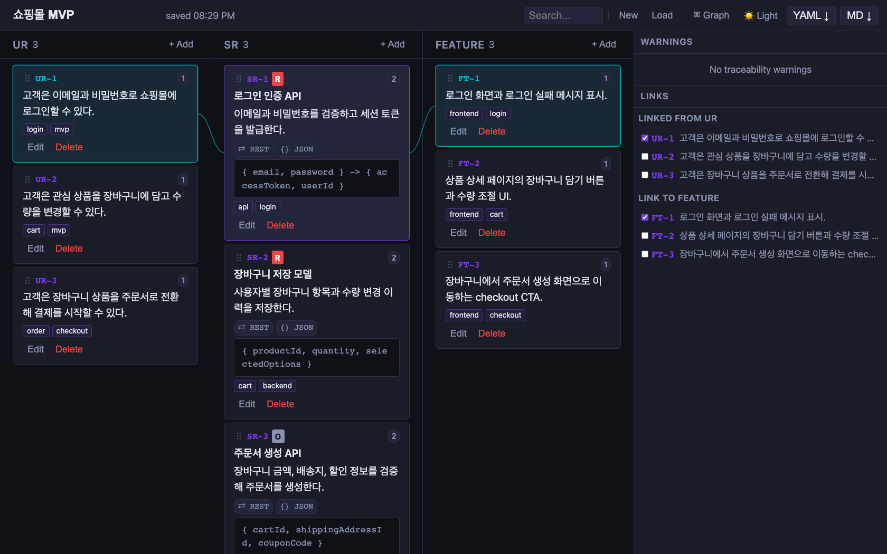
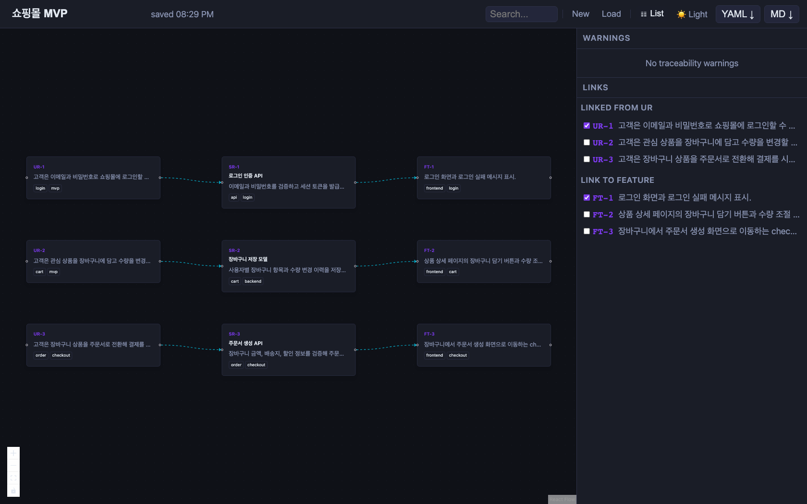

# Spectra: Requirements Traceability Board

Spectra는 엔지니어링 프로젝트의 **사용자 요구사항(UR)**, **시스템 요구사항(SR)**, 그리고 **구현 기능(Feature)** 간의 관계를 관리하고 시각화하는 경량 요구사항 추적 툴입니다.

복잡한 요구사항 간의 연결 고리를 한눈에 파악하고, 누락된 추적성(Traceability Gap)을 실시간으로 감지하여 프로젝트의 정합성을 유지하도록 돕습니다.

**Live Demo**: https://spectra-pied.vercel.app

## Demo

### Board View



### Graph View



## Key Features

- **Domain-based ID Auto-increment**: 카드의 접두사(Domain)를 설정하면, 동일 도메인 내에서만 숫자가 카운트업 되는 유연한 ID 포맷팅(`UR-AUTH-01`, `UR-ORD-02`)을 지원합니다.
- **Interactive Trace Board**: 카드를 선택하면 연관된 요구사항을 테두리 강조로 즉시 시각화하며, 복잡한 추적성을 명확하게 파악할 수 있는 목록 기반 보드 뷰를 제공합니다.
- **Full Traceability Path**: 특정 카드를 선택하면 직속 상/하위뿐만 아니라 꼬리를 무는 전체 연관 경로(UR ↔ SR ↔ Feature)가 리스트 및 그래프에서 즉시 강조(Highlight)됩니다.
- **Graph Visualization**: @xyflow/react 기반 다이내믹 네트워크 그래프를 통해 거시적인 구조 탐색을 지원합니다.
- **Unified Aesthetics**: Markdown 상세 패널, 일관된 라벨 및 상태 칩(Warning, Info, Error 등), 최적화된 폰트 등 가독성에 최적화된 문서를 제공합니다.
- **Real-time Gap Detection**: 연결되지 않은 UR, 부모가 없는 SR 등 누락된 추적성 경고를 실시간으로 감지합니다.
- **Tags & Metadata**: 우선순위, 프로토콜, 담당자, 검증 상태 등 상세 명세를 기록하고, 태그를 통해 도메인이나 영역별로 검색할 수 있습니다.
- **Local-First & Export**: 서버나 로그인 없이 브라우저 단에서 즉시 동작하며, 프로젝트를 YAML, Markdown 리포트로 간편히 내보낼 수 있습니다.

## How to Use

1. **요구사항 생성**: 각 컬럼의 `+ Add` 버튼을 눌러 UR, SR, Feature를 추가합니다.
2. **도메인 지정 (Domain ID)**: Edit 창에서 `Domain (for ID)` 칸에 `ORD`, `AUTH` 등의 도메인 명을 기입하면 카드의 순서에 맞춰 ID 넘버링이 자동 처리됩니다.
3. **메타데이터 입력 & 태그 지정**: 담당자(Reporter), 리뷰 상태, 검증 상태, 수용 기준(Acceptance Criteria) 등을 기록하고 쉼표로 태그를 덧붙여 빠르게 분류합니다.
4. **링크 연결**: 항목을 선택한 후 우측 `Trace Links` 패널에서 관련 문서를 연결합니다.
5. **무결성 검증**: 우측 `Review Issues` 패널에서 추적성이 누락된 항목을 확인하고 바로 추적을 메울 수 있습니다.
6. **풀 경로 시각화 (Traceability)**: 카드를 선택하면 연결된 모든 상/하위 카드가 보드에서는 테두리 강조로, 그래프에서는 엣지 하이라이트로 즉시 표시됩니다.
7. **데이터 보존**: 작업 내용은 로컬 환경에 실시간 자동 저장되며, 언제든 백업용 YAML로 꺼낼 수 있습니다.

## Data & Privacy

Spectra는 현재 LocalStorage 기반의 local-first 앱입니다.

- 별도 서버 DB나 로그인 없이 브라우저 안에 데이터를 저장합니다.
- 데이터는 브라우저와 기기별로 분리됩니다.
- 브라우저 데이터를 삭제하면 저장된 프로젝트도 사라질 수 있습니다.
- 장기 보관이나 다른 환경 이동이 필요하면 `YAML` export를 백업으로 사용하세요.
- `Markdown` export는 공유, 리뷰, 문서화용 리포트에 적합합니다.

## Local Development

```bash
git clone https://github.com/sohee-zoe/spectra.git
cd spectra
npm install
npm run dev
```

## Verification

```bash
npm test
npm run typecheck
npm run build
```

## Tech Stack

- **Core**: React 18, Vite, TypeScript
- **Styling**: Vanilla CSS
- **Graph Engine**: @xyflow/react
- **Serialization**: js-yaml
- **Drag & Drop**: @dnd-kit
